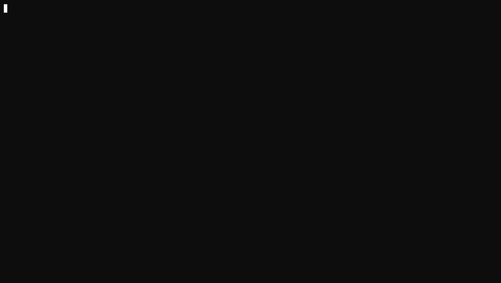

  

<h1 align="center">Olá! Eu sou o Túlio 👋</h1>
<h3 align="center"><i>
  Fullstack Developer focado em aplicações web completas,
  do backend à interface, com atenção à arquitetura e performance.
</i></h3>
<table>
<tr>
<td valign="top" width="50%">

<h1 align="center">🧠 Sobre mim</h1>

- 🎓 Engenharia de Software — UniFacef (1º semestre)
- 🧪 Desenvolvimento fullstack com foco em APIs, arquitetura e integração client/server
- 📚 Interesse em sistemas distribuídos, modelagem de dados e design de aplicações
- 🔥 Construção de projetos reais priorizando eficiência, escalabilidade e organização

<picture align="center">
  <source media="(prefers-color-scheme: dark)" srcset="https://github-readme-streak-stats.herokuapp.com?user=tulin404&theme=dark&locale=pt_BR&exclude_days=Sun%2CSat" />
  
</picture>

</td>

<td valign="top" width="50%">

<h1 align="center">🤖 Tecnologias</h1>

<h1 align="center" >⚙️ Engenharia</h1>

🔹 Arquitetura em camadas (controller/service/repository)  
🔹 Separação de responsabilidades (backend e frontend)  
🔹 APIs REST bem estruturadas e consumo no frontend  
🔹 Integração frontend ↔ backend (fetch/axios, tratamento de estado e erros)  
🔹 Componentização e organização de UI (React)  
🔹 Gerenciamento de estado no frontend  
🔹 Modelagem de banco de dados relacional  
🔹 Containers e ambiente isolado com Docker  
🔹 Fluxo completo: interface → API/MQ (jobs & workers) → banco de dados  
 

</td>
</tr>
</table>

 

<!-- <table align="center">
<tr>
<td align="center">
  <h1>🌟 Projects</h1>
</td>
</tr>
</table> -->

<!--
**tulin404/tulin404** is a ✨ _special_ ✨ repository because its `README.md` (this file) appears on your GitHub profile.

Here are some ideas to get you started:

- 🔭 I’m currently working on ...
- 🌱 I’m currently learning ...
- 👯 I’m looking to collaborate on ...
- 🤔 I’m looking for help with ...
- 💬 Ask me about ...
- 📫 How to reach me: ...
- 😄 Pronouns: ...
- ⚡ Fun fact: ...
-->
